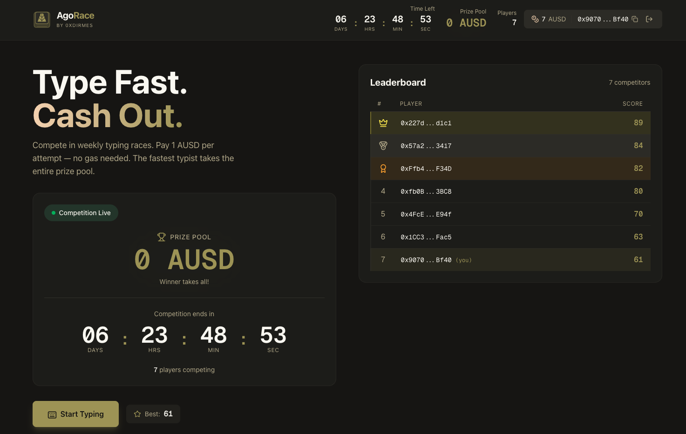
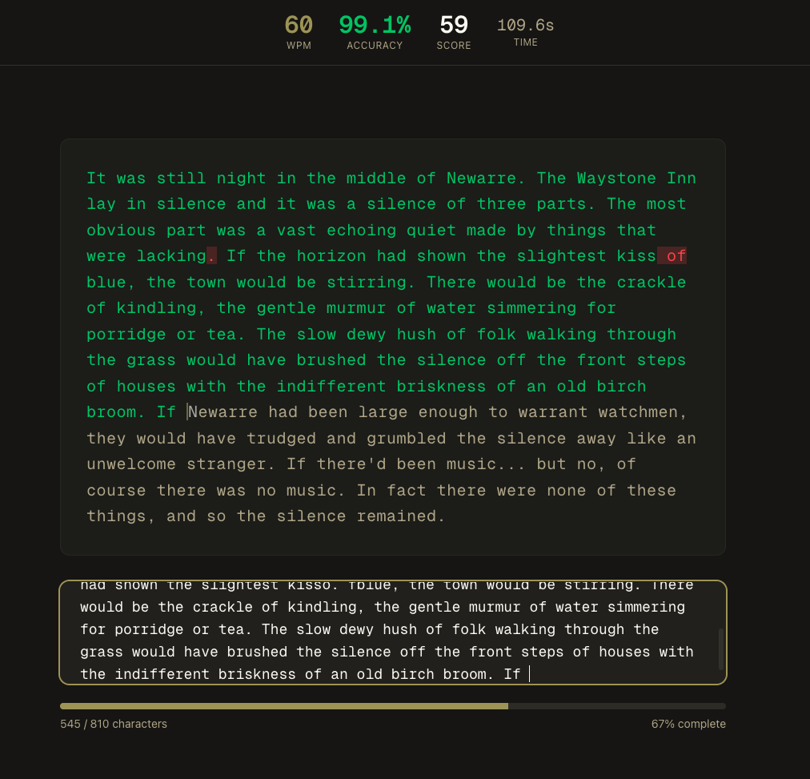

# AgoRace

Type fast. Win crypto. No seed phrases, no gas fees, no browser extensions.

AgoRace is a **weekly on-chain typing competition** built on Arbitrum Sepolia. Players pay 1 AUSD per attempt, compete for the highest typing score, and the winner takes the entire prize pool. All game state lives on-chain — no database, fully transparent.

> **Status:** Beta on Arbitrum Sepolia (testnet). Not audited. Do not use production funds.





## How It Works

1. **Connect** — Sign in with a passkey (Face ID, fingerprint) via [Porto](https://porto.sh). No browser extension needed.
2. **Approve** — One-time AUSD approval, gas-sponsored by the app.
3. **Play** — Type the passage as fast and accurately as possible. Score = `WPM x accuracy%`.
4. **Win** — Highest score at the end of the week takes the entire pot.

## Why Porto?

AgoRace uses [Porto](https://porto.sh) (by [Ithaca](https://ithaca.xyz)) for wallet management, built on EIP-7702 smart accounts with passkey authentication. This means:

- **No seed phrases** — Sign in with biometrics, just like any app
- **No gas tokens** — The app sponsors gas; users never need ETH
- **No browser extension** — Porto is embedded directly in the page
- **One-click approval** — Token approval + gas sponsorship batched in a single interaction

Traditional wallets require installing an extension, writing down a 12-word seed phrase, buying ETH, bridging it to the right chain, and confirming multiple popups. Porto reduces all of that to a single fingerprint tap.

## Architecture

```
┌─────────────┐     ┌──────────────┐     ┌──────────────────┐
│   Browser    │────>│  Next.js API │────>│  AgoRace.sol     │
│  (Porto SDK) │     │  (Operator)  │     │  (Arb Sepolia)   │
└─────────────┘     └──────────────┘     └──────────────────┘
       │                                          │
       │  1. Passkey auth                         │  3. Store score
       │  2. AUSD approval (EIP-2612)             │  4. Track pot
       │                                          │  5. Settle winner
       └──────────────────────────────────────────┘
```

- **Frontend** calculates the score client-side (WPM x accuracy)
- **Server** submits the score on-chain via the operator role (pays gas)
- **Contract** pulls 1 AUSD from the player, records the score, accumulates the pot
- **Settlement** transfers the entire pot to the highest scorer

## Tech Stack

| Layer | Technology |
|-------|-----------|
| **Contracts** | Solidity 0.8.28, Foundry, upgradeable via ERC-1967 proxy |
| **Frontend** | Next.js 15 (App Router), Tailwind CSS, Framer Motion |
| **Web3** | wagmi v3, viem v2, Porto SDK (EIP-7702) |
| **Auth** | Porto passkeys (WebAuthn / P256) |
| **Chain** | Arbitrum Sepolia (testnet) |
| **Hosting** | Vercel |

## Contracts

All contracts are deployed on **Arbitrum Sepolia** (chain ID: 421614).

| Contract | Address |
|----------|---------|
| AgoRace (Proxy) | [`0x5e3b4d6B110428E716DE572786Ed85d301bdd93a`](https://sepolia.arbiscan.io/address/0x5e3b4d6B110428E716DE572786Ed85d301bdd93a) |
| AgoRace (Impl v3.1.0) | [`0x60fC94Ee5efa8FAFF8c8Cd163f45Af19E6316a05`](https://sepolia.arbiscan.io/address/0x60fC94Ee5efa8FAFF8c8Cd163f45Af19E6316a05) |
| AUSD | [`0xa9012a055bd4e0edff8ce09f960291c09d5322dc`](https://sepolia.arbiscan.io/address/0xa9012a055bd4e0edff8ce09f960291c09d5322dc) |

### Contract Features

- **Pay-per-attempt**: 1 AUSD fee per game, accumulated into the prize pot
- **EIP-2612 permit**: Porto-compatible gasless token approval
- **Admin controls**: Owner can force-restart competitions and restore scores
- **Auto-settlement**: Frontend auto-settles expired competitions on first visit
- **Scoring**: Stored as `uint32` scaled by 100 (e.g., 76.50 → 7650)

## Getting Started

### Prerequisites

- [Node.js](https://nodejs.org/) v20+
- [Foundry](https://getfoundry.sh/) (for contract development)

### Frontend

```bash
git clone https://github.com/0xDirmes/agorace.git
cd agora-type/frontend
npm install

# Configure environment
cp .env.local.example .env.local
# Fill in: SERVER_PK, MERCHANT_ADDRESS, MERCHANT_PRIVATE_KEY

# Run dev server (HTTPS required for Porto passkeys)
npm run dev
```

### Contracts

```bash
# Run tests (forks Arbitrum Sepolia with real AUSD)
FOUNDRY_PROFILE=test forge test

# Format
forge fmt
```

## Project Structure

```
agora-type/
├── src/
│   ├── contracts/
│   │   ├── AgoRace.sol          # Main competition contract
│   │   ├── interfaces/          # Contract interfaces
│   │   └── mocks/               # Test tokens
│   ├── test/                    # Foundry tests (fork-based)
│   └── script/                  # Deployment scripts
├── frontend/
│   ├── app/                     # Next.js pages (/, /play, /demo)
│   ├── components/              # React components
│   │   ├── typing/              # TypingGame, PassageDisplay, LiveStats
│   │   ├── competition/         # Leaderboard, CompetitionStatus, PrizePool
│   │   └── wallet/              # ConnectButton (Porto integration)
│   ├── hooks/                   # Custom hooks (useLeaderboard, useSubmitAttempt, etc.)
│   └── lib/                     # Utilities (scoring, contracts, config)
├── docs/                        # Design notes and planning docs
├── DESIGN.md                    # Architecture deep-dive
└── SETUP.md                     # Deployment & testing guide
```

## Documentation

- **[DESIGN.md](./DESIGN.md)** — Architecture, game rules, contract design, user flow, and known issues
- **[SETUP.md](./SETUP.md)** — Deployment checklist, environment setup, and testing guide
- **[STYLE_GUIDE.md](./STYLE_GUIDE.md)** — Solidity conventions

## Security

This project is a **testnet demo** and has **not been audited**. Notable considerations:

- Scoring is calculated client-side (the server trusts the frontend). A production version would need server-side replay verification or on-chain keystroke recording.
- The operator role can submit scores on behalf of any player. This is a trusted role held by the server.
- Porto passkey signatures use P256 (WebAuthn), verified on-chain via EIP-1271 through EIP-7702 delegation.

See [DESIGN.md — Known Issues](./DESIGN.md) for more details.

## License

[Apache-2.0](./LICENSE)

## Author

Built by [@Dirmes1](https://x.com/Dirmes1) as a side project exploring EIP-7702 account abstraction with Porto.
